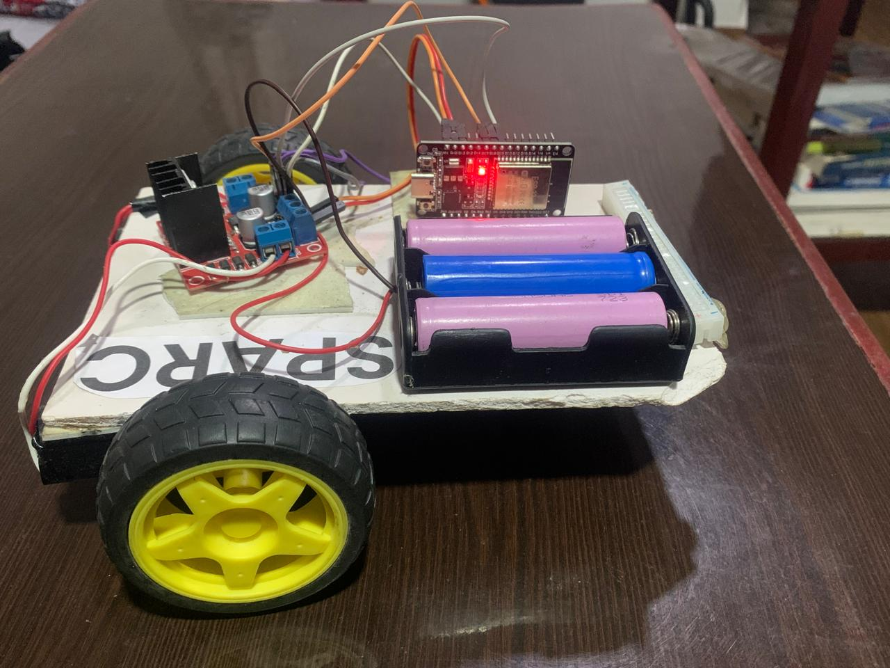

# Vision-Drive

## About
# Vision-Drive

Vision-Drive is a **smart wheelchair prototype** that enables hands-free movement by interpreting **hand gestures and eye-pupil movements**. Built using **Computer Vision and AI**, the system uses trained **CNN models** to recognize gestures and track eye movements, translating them into intuitive wheelchair commands. An **ESP32 microcontroller** serves as the core hardware controller, receiving these commands and controlling the wheelchair's movement.
